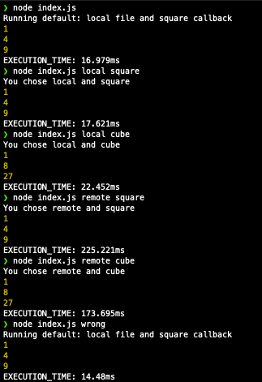

# README
This script takes a csv file from your local machine or remote as input, and for each element a transformer function is applied.

# HOW TO RUN PROJECT
1. Clone and install dependencies.
```console
npm i
```
2. Run project.
Syntax
```console
node index.js
node index.js <option1> <option2>
```
`option1` represents how you want to access the csv file. Either local or remote. Values: `local` or `remote`.

`option2` represents the transformer function. Currently it accepts two values `square` and `cube`. The first will square a number and the second will return a cube number.

You can run any of the below commands:
```console
node index.js
node index.js local square
node index.js local cube
node index.js remote square
node index.js remote cube
node index.js remotex cubex //error
```


# PROS AND CONS
## Pros:
- The use of streams. `createReadStream()` takes a file, it could be a very large file, and breaks it into smaller chunks. `parse()` method from `csv-parse` is the second stream, actually a transform stream.
- The leverage of `process.argv` to capture user input and provide a dash of interactiveness.
- The project applies SOLID principles. `S` (Single responsablity) for functions like `printMessage`, `square`, etc. `O` (Open Closed Principle) `cube` transformer function was added and others can easily be added in the index.js file.
## Cons:
- Project does not include any type of test because of time constraint. Needless to say, testing is very important.
- Project could have used the package `inquirer` to provide a much nicer command line interface.
- Project hardcodes values like the url to retreive csv files. Typically you want to use env vars.
- Project does not use common libries or packages like `lint` for code analysis, `dotenv` for env vars, `mocha` for functional testing, etc.

# LIBRARIES / DEPENDENCIES
- csv-parse: I used this package that has a parser, which i used for each row in the csv file.
- axios: I used this package to make http requests. Particularly to `get` a remote csv file. (expressjs is used to create a server and i did not need that.)